# Coleta de Resíduos - API .NET 8

Sistema inteligente de gerenciamento de coleta de resíduos desenvolvido em .NET 8 com Oracle, integrado com Docker, CI/CD automatizado e autenticação JWT.

A aplicação permite cadastro de resíduos, gerenciamento de pontos de coleta, agendamento de coletas, emissão de alertas e rastreamento completo do processo de coleta.

---

## 📋 Sumário

- [Como executar localmente com Docker](#-como-executar-localmente-com-docker)
- [Pipeline CI/CD](#-pipeline-cicd)
- [Containerização](#-containerização)
- [Prints do funcionamento](#-prints-do-funcionamento)
- [Tecnologias utilizadas](#-tecnologias-utilizadas)
- [Estrutura do Projeto](#-estrutura-do-projeto)
- [Endpoints Principais](#-endpoints-principais)
- [Segurança & Configuração](#-segurança--configuração)

---

## 🐳 Como executar localmente com Docker

### Pré-requisitos

- Docker Desktop instalado ([Download](https://www.docker.com/products/docker-desktop))
- Docker Compose (incluído no Docker Desktop)
- Arquivo `.env` configurado (veja abaixo)

---

### 🚀 Opção 1: Usar a imagem publicada no DockerHub (SEM clonar repositório)

Se você quiser apenas **executar a aplicação** sem modificações de código, esta é a forma mais rápida.

#### Passo 1: Criar estrutura de diretórios

```bash
# Crie uma pasta para o projeto
mkdir coleta-residuos
cd coleta-residuos
```

#### Passo 2: Criar arquivo `.env`

Crie um arquivo chamado `.env` com as seguintes variáveis:

```bash
# Credenciais do Oracle
ORACLE__USER=system
ORACLE__PASSWORD=Oradoc_db1
ORACLE__HOST=db
ORACLE__PORT=1521
ORACLE__SERVICE=xe

# JWT Secret (mínimo 32 caracteres)
JWTSETTINGS__SECRET=aB3cD4eF5gH6iJ7kL8mN9oP0qR1sT2uV3wX4yZ5aB6cD7eF8gH9iJ0kL1mN2oP3qR4

# Ambiente
ASPNETCORE_ENVIRONMENT=Development
```

#### Passo 3: Criar arquivo `docker-compose.yml`

Crie um arquivo chamado `docker-compose.yml` com o seguinte conteúdo:

```yaml
services:
  db:
    container_name: oracle-xe
    image: gvenzl/oracle-xe:21.3.0
    ports:
      - "1521:1521"
    env_file:
      - .env
    environment:
      ORACLE_PASSWORD: ${ORACLE__PASSWORD}
    volumes:
      - db_data:/opt/oracle/oradata
    healthcheck:
      test: ["CMD", "bash", "-c", "echo 'SELECT 1 FROM DUAL;' | sqlplus system/$${ORACLE_PASSWORD}@db:1521/xe"]
      interval: 10s
      timeout: 5s
      retries: 120
      start_period: 60s

  api:
    image: stephaniegomes/coleta-residuos:latest
    container_name: coleta-residuos-app
    ports:
      - "8080:8080"
      - "8081:8081"
    depends_on:
      db:
        condition: service_healthy
    env_file:
      - .env

volumes:
  db_data:
```

#### Passo 4: Executar a aplicação

```bash
# Subir os containers
docker-compose up -d

# Acompanhar os logs
docker-compose logs -f api

# Parar a aplicação
docker-compose down

# Remover volumes (limpar banco de dados)
docker-compose down -v
```

#### Passo 5: Acessar a aplicação

- **API**: `http://localhost:8080`
- **Swagger**: `http://localhost:8080/swagger`

---

### 💻 Opção 2: Clonar o repositório e executar localmente (COM código-fonte)

Se você quiser **modificar o código** ou **contribuir** para o projeto, use esta opção.

#### Passo 1: Clonar o repositório

```bash
git clone https://github.com/StephanieGdSantos/coleta-residuos.git
cd coleta-residuos
```

#### Passo 2: Preparar o arquivo `.env`

```bash
# Copie o template de exemplo
cp .env.example .env

# Edite o .env com suas variáveis (mesmo conteúdo da Opção 1):
# ORACLE__USER=system
# ORACLE__PASSWORD=Oradoc_db1
# ... (veja acima)
```

#### Passo 3: Executar com Docker Compose

```bash
# Subir os containers
docker-compose up -d

# Acompanhar os logs
docker-compose logs -f api

# Parar a aplicação
docker-compose down

# Remover volumes
docker-compose down -v
```

#### Passo 4: Acessar a aplicação

- **API**: `http://localhost:8080`
- **Swagger**: `http://localhost:8080/swagger`

#### Passo 5 (Opcional): Executar testes localmente

Se tiver .NET 8 SDK instalado:

```bash
# Restaurar dependências
dotnet restore

# Executar testes
dotnet test coleta-residuos.Tests

# Executar aplicação localmente (sem Docker)
dotnet run --project coleta-residuos/coleta-residuos.csproj
```

---

### ⚠️ Fluxo de inicialização

Independentemente da opção escolhida:

1. **Oracle XE inicia** (~60 segundos)
3. **Aplicação aguarda 2 minutos** (script `entrypoint.sh`)
4. **Aplicação inicia e executa migrations**

> **TEMPO TOTAL**: ~2-3 minutos para estar totalmente pronta

### 🔍 Verificar se tudo está funcionando

```bash
# Ver status dos containers
docker-compose ps

# Testar healthcheck do Oracle
docker-compose exec db bash -c "echo 'SELECT 1 FROM DUAL;' | sqlplus system/Oradoc_db1@db:1521/xe"

# Ver logs da aplicação
docker-compose logs api
```

> 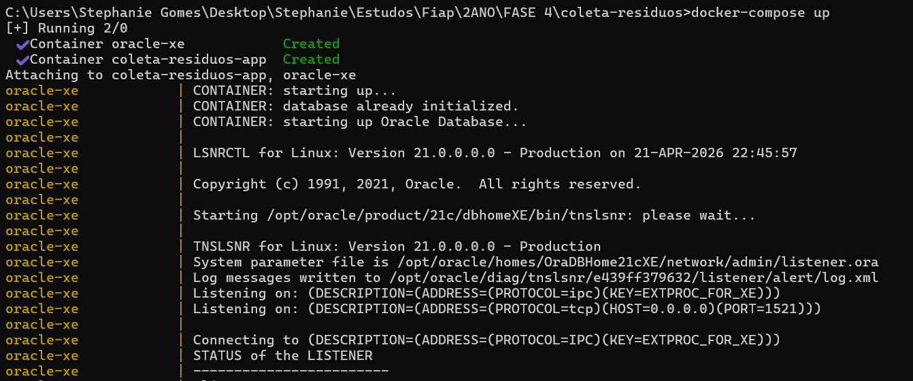 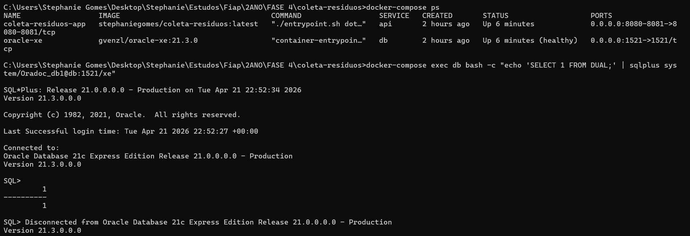

> 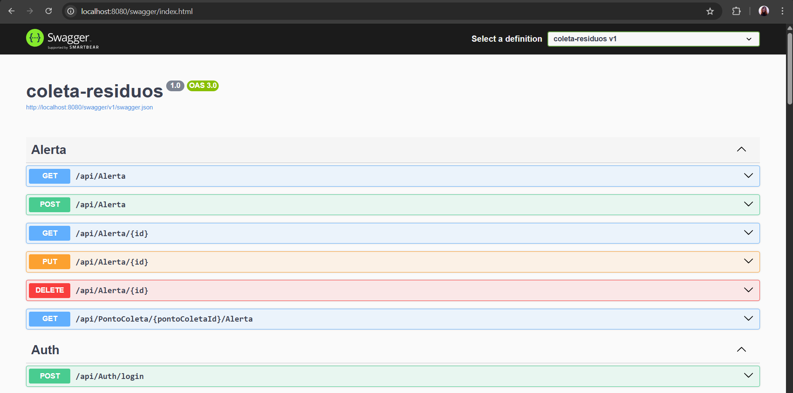

> 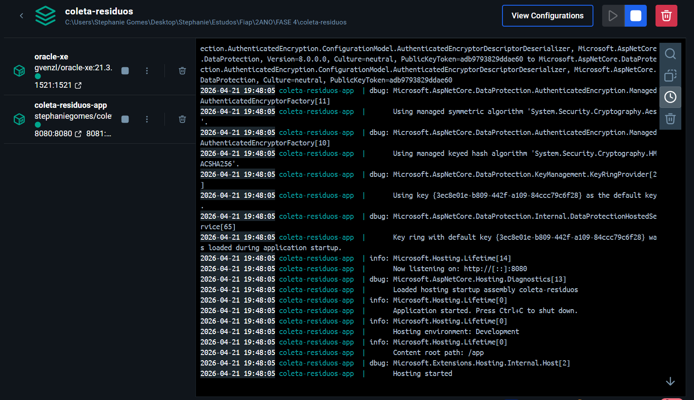

---

## 🔄 Pipeline CI/CD

### Arquitetura e Fluxo

O projeto utiliza **GitHub Actions** para automação de build, testes e deploy contínuo. O pipeline segue a estratégia **GitFlow** com três workflows principais:

```
feature/** → Build + Test
    ↓
develop → Build + Push Docker (tag: staging)
    ↓
main → Build + Push Docker (tag: latest)
```

### Ferramentas utilizadas

| Ferramenta | Propósito | Local |
|-----------|----------|--------|
| **GitHub Actions** | CI/CD Automation | `.github/workflows/` |
| **Docker** | Containerização | `Dockerfile` |
| **DockerHub** | Registro de imagens | `stephaniegomes/coleta-residuos:*` |
| **.NET 8 CLI** | Build e publish | GitHub Actions runner |
| **xUnit** | Testes automatizados | `coleta-residuos.Tests/` |

### Workflows Detalhados

#### 1️⃣ **CI Feature** (Branches `feature/**`)

**Acionador**: Push em qualquer branch `feature/*`

**Etapas**:
1. Checkout do código
2. Setup .NET 8
3. Restore dependências
4. Build em modo Release
5. Executar testes automatizados (xUnit)
6. Criar PR automaticamente para `develop`

**Arquivo**: `.github/workflows/01-ci-feature.yml`

```yaml
on:
  push:
    branches:
      - 'feature/**'

jobs:
  build-and-test:
    runs-on: ubuntu-latest
    steps:
      - uses: actions/checkout@v3
      - uses: actions/setup-dotnet@v3
        with:
          dotnet-version: '8.0.x'
      - run: dotnet build coleta-residuos.sln -c Release
      - run: dotnet test coleta-residuos.Tests -c Release --verbosity normal
```

#### 2️⃣ **Deploy Staging** (Branch `develop`)

**Acionador**: Push em `develop` (após merge de PR)

**Etapas**:
1. Checkout do código
2. Setup .NET 8
3. Build e testes
4. **Build da imagem Docker** com tag `staging`
5. **Push para DockerHub**
6. Criar PR automaticamente para `main`

**Arquivo**: `.github/workflows/02-deploy-staging.yml`

```yaml
on:
  push:
    branches:
      - develop

jobs:
  build-and-deploy:
    runs-on: ubuntu-latest
    steps:
      - uses: actions/checkout@v3
      - name: Build and push Docker image (staging)
        run: |
          docker build -t stephaniegomes/coleta-residuos:staging .
          echo "${{ secrets.DOCKERHUB_TOKEN }}" | docker login -u "${{ secrets.DOCKERHUB_USERNAME }}" --password-stdin
          docker push stephaniegomes/coleta-residuos:staging
      - name: Create PR to main
        run: gh pr create --base main --head develop
        env:
          GH_TOKEN: ${{ secrets.GH_TOKEN }}
```

#### 3️⃣ **Deploy Production** (Branch `main`)

**Acionador**: Push em `main` (após merge de PR)

**Etapas**:
1. Checkout do código
2. Setup .NET 8
3. Build e testes
4. **Build da imagem Docker** com tag `latest`
5. **Push para DockerHub**
6. Deploy automático em produção (se configurado)

**Arquivo**: `.github/workflows/03-deploy-prod.yml`

```yaml
on:
  push:
    branches:
      - main

jobs:
  build-and-deploy:
    runs-on: ubuntu-latest
    steps:
      - uses: actions/checkout@v3
      - name: Build and push Docker image (production)
        run: |
          docker build -t stephaniegomes/coleta-residuos:latest .
          echo "${{ secrets.DOCKERHUB_TOKEN }}" | docker login -u "${{ secrets.DOCKERHUB_USERNAME }}" --password-stdin
          docker push stephaniegomes/coleta-residuos:latest
```

## 📦 Containerização

### Dockerfile Multi-Stage

A aplicação utiliza um Dockerfile multi-stage para otimizar o tamanho da imagem:

```dockerfile
FROM mcr.microsoft.com/dotnet/aspnet:8.0 AS base
WORKDIR /app
EXPOSE 8080
EXPOSE 8081

FROM mcr.microsoft.com/dotnet/sdk:8.0 AS build
ARG BUILD_CONFIGURATION=Release
WORKDIR /src
COPY . .
RUN dotnet restore "./coleta-residuos/coleta-residuos.csproj"
RUN dotnet build "./coleta-residuos/coleta-residuos.csproj" -c $BUILD_CONFIGURATION -o /app/build

FROM build AS publish
ARG BUILD_CONFIGURATION=Release
RUN dotnet publish "./coleta-residuos/coleta-residuos.csproj" -c $BUILD_CONFIGURATION -o /app/publish /p:UseAppHost=false

FROM base AS final
ARG ASPNETCORE_ENVIRONMENT=Production
WORKDIR /app
COPY --from=publish /app/publish .
COPY entrypoint.sh .
RUN chmod +x ./entrypoint.sh
ENTRYPOINT ["./entrypoint.sh"]
CMD ["dotnet", "coleta-residuos.dll"]
```

### Estratégias de Otimização

| Estratégia | Benefício | Implementação |
|-----------|----------|----------------|
| **Multi-stage build** | Reduz tamanho da imagem final | Apenas código publicado é copiado para `base` |
| **Cache de layers** | Acelera rebuilds | Restore e build são layers separados |
| **Entrypoint script** | Controla inicialização para garantir que o banco esteja pronto para conexão com a aplicação | `entrypoint.sh` com delay de 2 minutos |
| **.dockerignore** | Exclui arquivos desnecessários | Ignora `bin/`, `obj/`, `.git/`, `.env` |

### Arquivo entrypoint.sh

```bash
#!/bin/bash
echo "Aguardando 2 minutos para garantir que o Oracle está pronto..."
sleep 120
echo "Iniciando a aplicação..."
exec "$@"
```

**Propósito**: Dar tempo suficiente para o Oracle completar sua inicialização antes de a aplicação tentar conectar.

### Docker Compose

```yaml
services:
  db:
    container_name: oracle-xe
    image: gvenzl/oracle-xe:21.3.0
    ports:
      - "1521:1521"
    env_file:
      - .env
    environment:
      ORACLE_PASSWORD: ${ORACLE__PASSWORD}
    volumes:
      - db_data:/opt/oracle/oradata
    healthcheck:
      test: ["CMD", "bash", "-c", "echo 'SELECT 1 FROM DUAL;' | sqlplus system/$${ORACLE_PASSWORD}@db:1521/xe"]
      interval: 10s
      timeout: 5s
      retries: 120
      start_period: 60s

  api:
    image: stephaniegomes/coleta-residuos:latest
    container_name: coleta-residuos-app
    ports:
      - "8080:8080"
      - "8081:8081"
    depends_on:
      db:
        condition: service_healthy
    env_file:
      - .env

volumes:
  db_data:
```

### Boas Práticas Implementadas

✅ **Isolamento de containers** - Oracle em um container, API em outro <br/>
✅ **Persistência de dados** - Volume `db_data` mantém dados entre restarts <br/>
✅ **Health checks** - Oracle valida conexão a cada 10s <br/>
✅ **Variáveis de ambiente** - Configuração via `.env` (nunca hardcoded) <br/>
✅ **Segurança de rede** - Comunicação entre containers pelo nome do serviço (`db`)

---

## 📸 Prints do funcionamento

### Ambiente Local - Execução

> 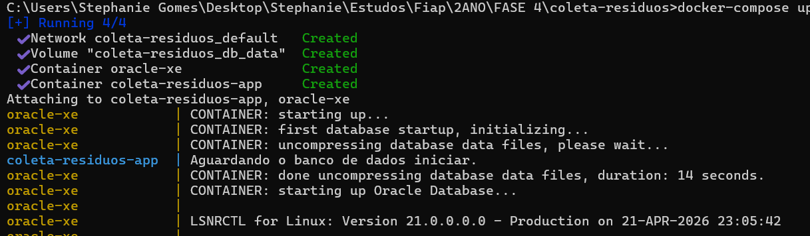
> ["Print da criação do container com a aplicação"](imagens-readme/container-aplicacao-sendo-criado.png)
> ["Print das migrations sendo realizadas"](imagens-readme/execucao-migrations.png)

### Ambiente Local - Docker Desktop

> 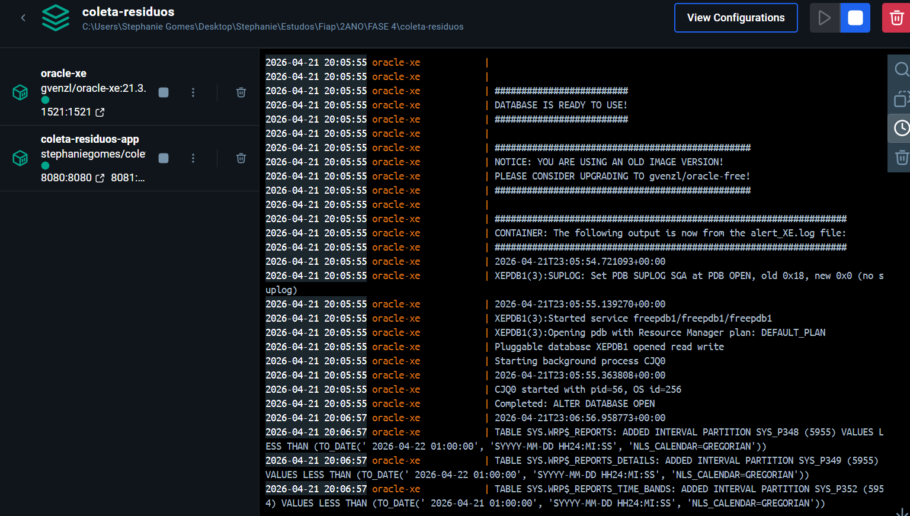

### Ambiente Local - Swagger UI

> 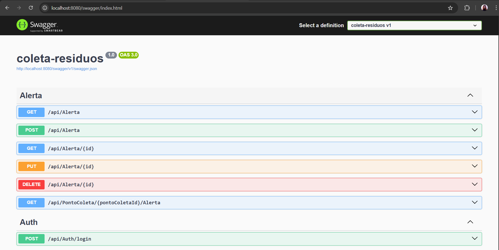

### Testes de Endpoints

> - **GET** `/api/residuo` - Listagem com status 200 
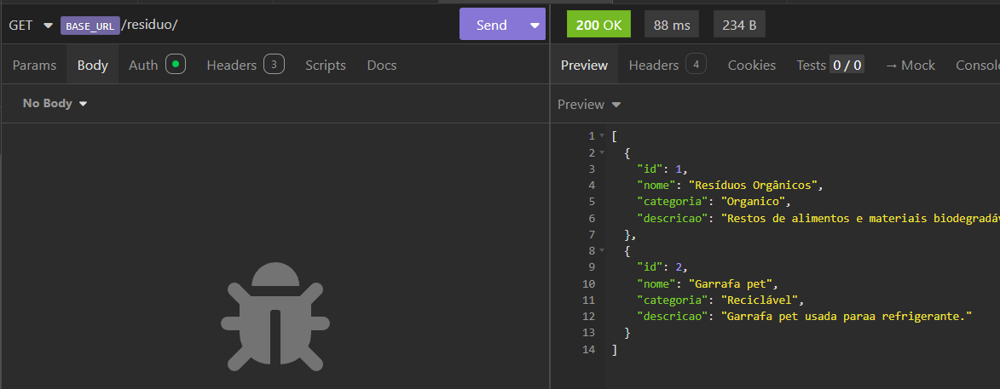
> - **POST** `/api/residuo` - Criação com status 201
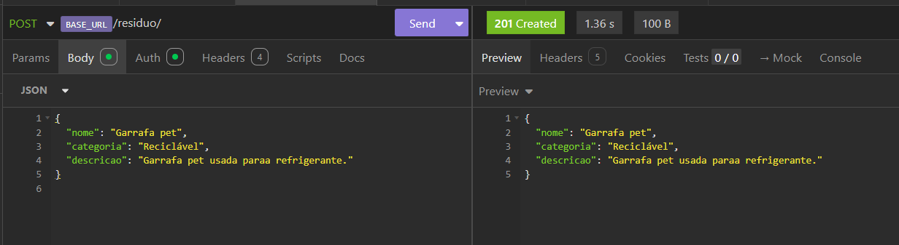
> - **PUT** `/api/residuo/{id}` - Atualização com status 200
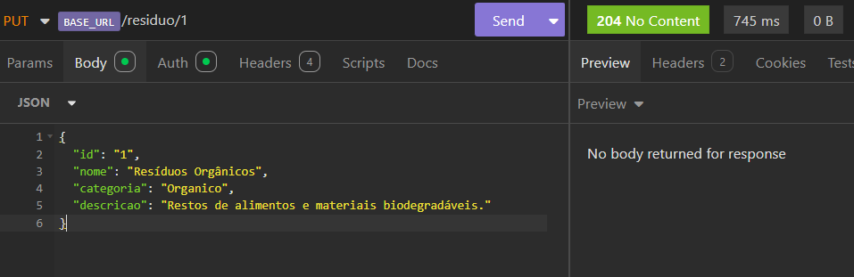
> - **DELETE** `/api/residuo/{id}` - Deleção com status 204
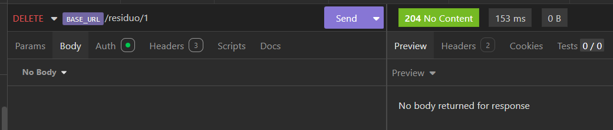

### Pipeline CI/CD - GitHub Actions

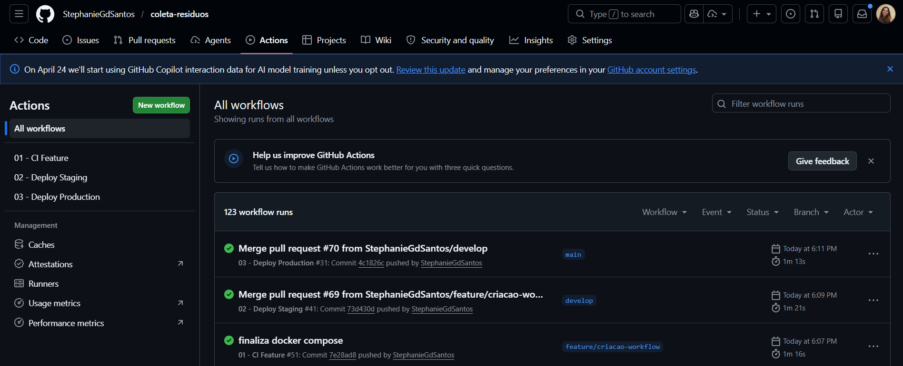
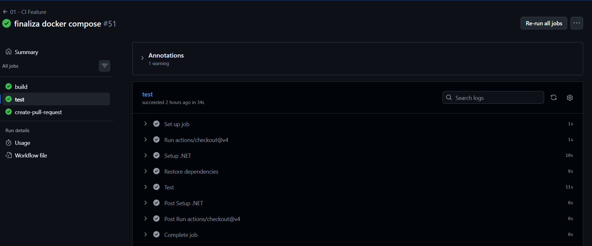
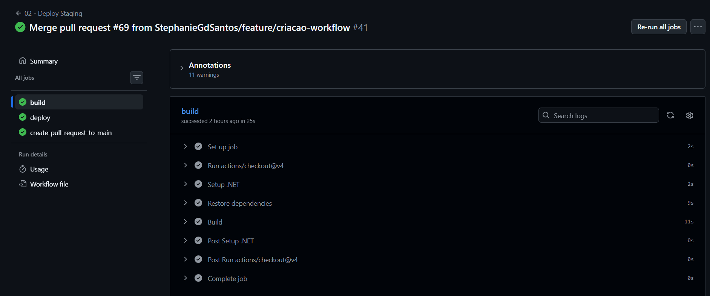
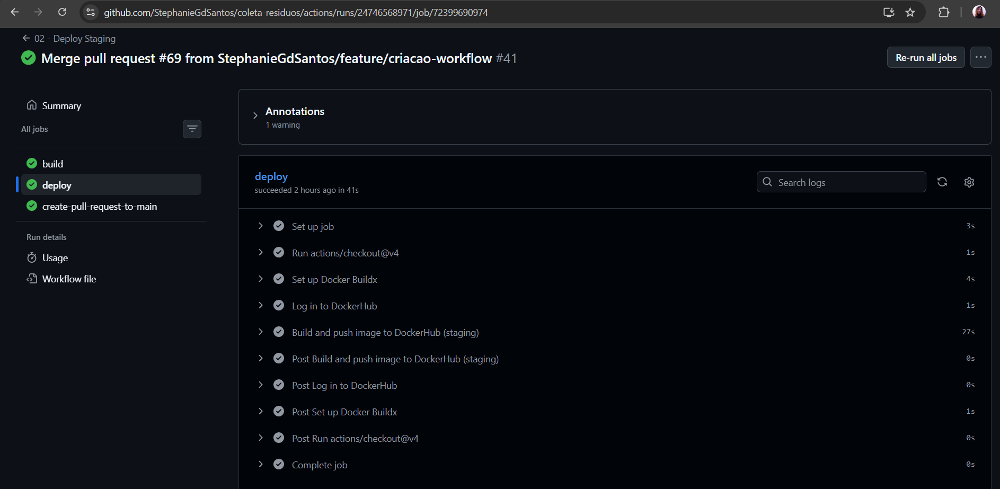
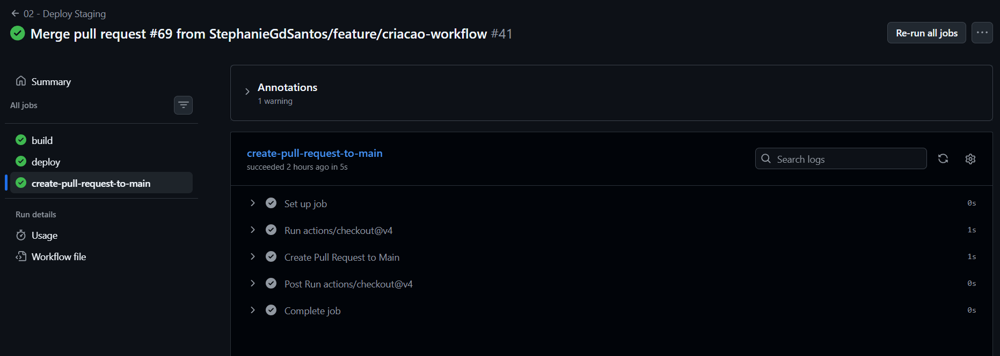

### Staging - Imagem Docker no DockerHub

> 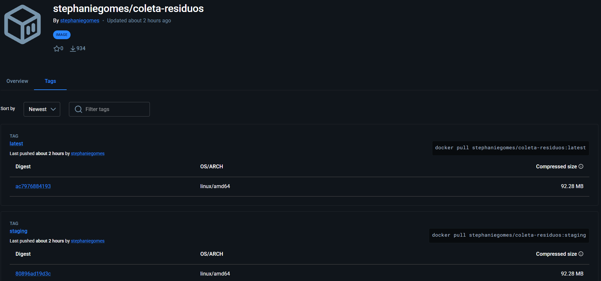

---

## 🛠️ Tecnologias utilizadas

### Backend & Framework
- **.NET 8** - Framework principal para desenvolvimento de APIs
- **C# 12** - Linguagem de programação
- **ASP.NET Core** - Framework web para APIs RESTful

### Banco de Dados
- **Oracle Database XE 21c** - Sistema gerenciador de banco de dados relacional
- **Entity Framework Core 8.0** - ORM (Object-Relational Mapping)
- **Migrations EF** - Versionamento de schema do banco

### Autenticação & Segurança
- **JWT (JSON Web Tokens)** - Autenticação stateless
- **Microsoft.IdentityModel.Tokens** - Validação de JWT
- **System.IdentityModel.Tokens.Jwt** - Geração de tokens

### Padrões & Patterns
- **Repository Pattern** - Abstração de acesso a dados
- **Dependency Injection** - Injeção de dependências nativa do .NET
- **AutoMapper** - Mapeamento entre Models e ViewModels

### APIs & Documentação
- **Swagger/OpenAPI 3.0** - Documentação interativa de endpoints
- **Swashbuckle.AspNetCore** - Geração automática de Swagger

### DevOps & Containerização
- **Docker** - Containerização de aplicação
- **Docker Compose** - Orquestração local de containers
- **GitHub Actions** - CI/CD automation
- **DockerHub** - Registro de imagens Docker

### Testes
- **xUnit** - Framework de testes automatizados
- **Moq** - Mock de dependências em testes

### Ferramentas & Utilitários
- **.NET CLI** - Interface de linha de comando
- **dotnet-ef** - Entity Framework CLI
- **Visual Studio / VS Code** - IDEs

### Gerenciamento de Código
- **Git** - Controle de versão
- **GitHub** - Repositório remoto
- **GitFlow** - Estratégia de branching

---

## 📂 Estrutura do Projeto

```
coleta-residuos/
│
├── .github/workflows/              # Configuração CI/CD
│   ├── 01-ci-feature.yml
│   ├── 02-deploy-staging.yml
│   └── 03-deploy-prod.yml
│
├── coleta-residuos/                # Projeto principal
│   ├── Controllers/                # Endpoints da API
│   │   ├── AlertaController.cs
│   │   ├── AuthController.cs
│   │   ├── ColetaAgendadaController.cs
│   │   ├── EventoColetaController.cs
│   │   ├── PontoColetaController.cs
│   │   └── ResiduoController.cs
│   │
│   ├── Models/                     # Modelos de dados
│   │   ├── AlertaModel.cs
│   │   ├── ColetaAgendadaModel.cs
│   │   ├── EventoColetaModel.cs
│   │   ├── PontoColetaModel.cs
│   │   ├── PontoColetaResiduoModel.cs
│   │   ├── ResiduoModel.cs
│   │   └── UserModel.cs
│   │
│   ├── ViewModel/                  # Modelos de entrada/saída
│   │   ├── AlertaViewModel.cs
│   │   ├── ColetaAgendadaViewModel.cs
│   │   ├── PontoColetaViewModel.cs
│   │   ├── ResiduoViewModel.cs
│   │   └── ... (outros ViewModels)
│   │
│   ├── Services/                   # Lógica de negócio
│   │   ├── IService.cs
│   │   ├── IAlertaService.cs
│   │   ├── IAuthService.cs
│   │   └── Impl/
│   │       ├── AlertaService.cs
│   │       ├── AuthService.cs
│   │       └── ... (implementações)
│   │
│   ├── Repository/                 # Acesso a dados
│   │   ├── IRepository.cs
│   │   └── Impl/
│   │       ├── AlertaRepository.cs
│   │       ├── ColetaAgendadaRepository.cs
│   │       └── ... (implementações)
│   │
│   ├── Data/
│   │   ├── Contexts/
│   │   │   └── DatabaseContext.cs  # DbContext principal
│   │   └── Repository/
│   │
│   ├── Migrations/                 # Migrações do Entity Framework
│   │   ├── 20251117013847_AddTabelasIniciais.cs
│   │   └── ... (outras migrações)
│   │
│   ├── Settings/                   # Configurações
│   │   └── JwtSettings.cs
│   │
│   ├── appsettings.json            # Configurações base
│   ├── appsettings.Development.json # Configurações dev
│   ├── appsettings.Production.json  # Configurações prod
│   ├── Program.cs                  # Inicialização
│   └── coleta-residuos.csproj      # Arquivo de projeto
│
├── coleta-residuos.Tests/          # Projeto de testes
│   ├── Controllers/
│   ├── Services/
│   ├── Fixtures/
│   └── coleta-residuos.Tests.csproj
│
├── docker-compose.yml              # Orquestração local
├── Dockerfile                      # Definição da imagem
├── entrypoint.sh                   # Script de inicialização
├── .env.example                    # Template de variáveis
├── .dockerignore                   # Arquivos ignorados no build
├── .gitignore                      # Arquivos ignorados no git
├── README.md                       # Este arquivo
└── coleta-residuos.sln             # Arquivo de solução
```

---

## 🔌 Endpoints Principais

### 🚮 **Resíduos**
```
GET    /api/Residuo                 # Listar todos (com paginação)
GET    /api/Residuo/{id}            # Obter por ID
POST   /api/Residuo                 # Criar novo
PUT    /api/Residuo/{id}            # Atualizar
DELETE /api/Residuo/{id}            # Deletar
```

### 📍 **Pontos de Coleta**
```
GET    /api/PontoColeta             # Listar todos
GET    /api/PontoColeta/{id}        # Obter por ID
GET    /api/PontoColeta/{id}/Residuo # Listar resíduos do ponto
POST   /api/PontoColeta             # Criar novo
PUT    /api/PontoColeta/{id}        # Atualizar
DELETE /api/PontoColeta/{id}        # Deletar
```

### 📅 **Coletas Agendadas**
```
GET    /api/ColetaAgendada          # Listar todas
POST   /api/ColetaAgendada          # Agendar coleta
PUT    /api/ColetaAgendada/{id}     # Atualizar agendamento
DELETE /api/ColetaAgendada/{id}     # Cancelar agendamento
```

### ⚠️ **Alertas**
```
GET    /api/Alerta                  # Listar alertas
POST   /api/Alerta                  # Criar alerta
DELETE /api/Alerta/{id}             # Resolver alerta
```

### 🔐 **Autenticação**
```
POST   /api/Auth/login              # Fazer login (obter JWT)
POST   /api/Auth/register           # Registrar novo usuário
```

Todos os endpoints retornam dados em **JSON** com status HTTP padrão:
- `200 OK` - Sucesso
- `201 Created` - Recurso criado
- `204 No Content` - Sucesso sem resposta
- `400 Bad Request` - Erro de validação
- `401 Unauthorized` - Sem autenticação
- `404 Not Found` - Recurso não encontrado
- `500 Internal Server Error` - Erro no servidor

---

## 🔒 Segurança & Configuração

### Autenticação JWT

A API utiliza **JWT (JSON Web Tokens)** para autenticação stateless:

1. **Login**: Enviar credenciais em `POST /api/Auth/login`
2. **Receber token**: Response contém `access_token`
3. **Usar token**: Adicionar header `Authorization: Bearer {token}` em todas as requisições protegidas

### Variáveis de Ambiente

Todas as credenciais são gerenciadas via variáveis de ambiente com a convenção **DOUBLE UNDERSCORE** (`__`) para mapeamento aninhado:

| Variável | Mapeia para | Exemplo |
|----------|-----------|---------|
| `ORACLE__USER` | `Oracle:User` | `system` |
| `ORACLE__PASSWORD` | `Oracle:Password` | `Oradoc_db1` |
| `ORACLE__HOST` | `Oracle:Host` | `db` |
| `ORACLE__PORT` | `Oracle:Port` | `1521` |
| `ORACLE__SERVICE` | `Oracle:Service` | `xe` |
| `JWTSETTINGS__SECRET` | `JwtSettings:Secret` | Mínimo 32 caracteres |
| `ASPNETCORE_ENVIRONMENT` | Ambiente | `Development`, `Staging`, `Production` |

### Configuração por Ambiente

O .NET carrega configurações em ordem de prioridade:

```
ASPNETCORE_ENVIRONMENT = Development
    ↓
1. appsettings.json (base)
2. appsettings.Development.json (sobrescreve)
3. Variáveis de Ambiente (sobrescreve tudo)
```

### Arquivo .gitignore

Arquivos sensíveis NUNCA são commitados:

```
# Variáveis de ambiente
.env
.env.local
.env.*.local

# Build artifacts
bin/
obj/
.vs/

# User secrets
**/Properties/launchSettings.json
```

### Arquivo .dockerignore

Apenas código necessário é incluído na imagem Docker:

```
# Build artifacts (não precisam)
bin/
obj/
[Bb]in/
[Oo]bj/

# Source control
.git
.gitignore

# Secrets (CRÍTICO!)
.env
.env.local
.env.*.local

# IDEs
.vs/
.vscode/
*.user
```

---

## 📝 Como contribuir

1. Crie uma branch feature: `git checkout -b feature/sua-feature`
2. Commit suas mudanças: `git commit -m "feat: descrição"`
3. Push para a branch: `git push origin feature/sua-feature`
4. Abra um Pull Request para `develop`

---

## 📄 Licença

Projeto desenvolvido para fins acadêmicos.

---

## 👨‍💼 Autor

**Stephanie Gomes dos Santos**

---
